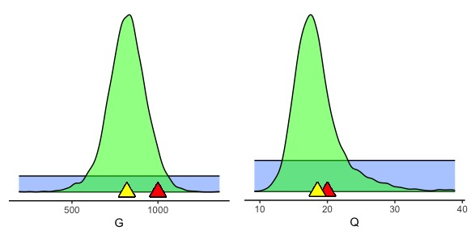
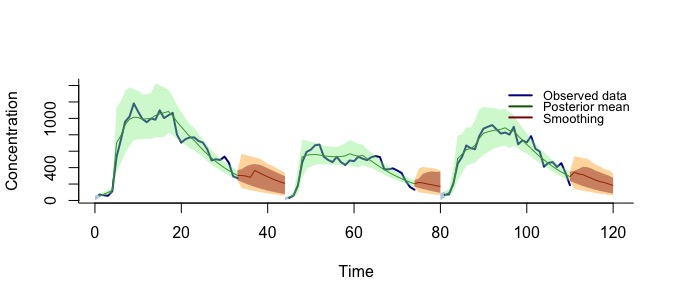

# RailcarExposureModelling Overview

## Background
A series of experiments in stationary and moving passenger rail cars were conducted to measure removal rates of particles in the size ranges of SARS-CoV-2 viral aerosols, and the air changes per hour provided by existing and modified air handling systems. Such methods for exposure assessments are customarily based on _mechanistic_ models derived from physical laws of particle movement that are deterministic and do not account for measurement errors inherent in data collection. The resulting analysis compromises on reliably learning about mechanistic factors such as ventilation rates, aerosol generation rates and filtration efficiencies from field measurements. [Hewett and Ganser, 2017](https://doi.org/10.1080/15459624.2016.1213392) gives concrete description such mechanistic systems under the "one-box" and "well-mixed room" assumption. One of such system we focus here is Model 111 which can be given by the differential equation $$V\frac{dC}{dt} = (1 - \epsilon_L \epsilon_{L.F})G - C(Q + \epsilon_{L.F} Q_L + \epsilon_{R.F} Q_R)$$ where, $G$ is the particle generation rate, $Q$ is ventilation rate, $V$ is volume of the experiment chamber etc.(see Hewett and ganser, 2017 for full details). The novelty of our application lies in the manner in which we address several data analytic challenges.

## Implementation
This repository implements a Bayesian state space modelling framework that synthesises information from the mechanistic system as well as the field data. We derive a stochastic model from finite difference approximations of differential equations explaining particle concentrations. Source code is located within the `src` folder with all methods and `jags` model files. The `test` directory contains executable codes in the form of `.R` files required to reproduce various simulation results as well as analysis of real field data. 

The following instructions will assume installation and use of the R statistical environment and RStudio. Most `.R` files in the `test` directory will produce the following output which can be based on both simulated and real experimental data. 

1. Posterior summary of mechanistic as well as statistical parameters

|     | Mean |  SD   | 2.5% | 50% | 97.5% |
|:-----:|:------:|:-------:|:------:|:-----:|:-------:|
|G    |  819.44 | 112.99 | 585.03 | 822.00 | 1034.10 |
|Q    |  18.53 |   3.70 | 13.36 | 17.86 | 28.47 |
|C.0  | 10.14 |  1.77 | 7.13 |  10.01 |  13.98 |
|sigma1 |  0.28 |  0.13 |  0.14 |  0.25 | 0.64 |
|sigma2 |  0.19 | 0.02  | 0.15  | 0.19  |  0.24 |
|m1   |   -1.40 |  1.84 | -5.14 | -1.39 |   1.57 |

2. Figure showing posterior samples of mechanistic parameters

3. Figure showing smoothing and forecasting 

Users willing to fit their own data (simulated/experimental) may create a new directory named `data` which will contain their new data in a specific format that can be found in the original `data` directory. It is advised to make a copy of the original `data` directory and accordingly follow the format of the files inside it.
